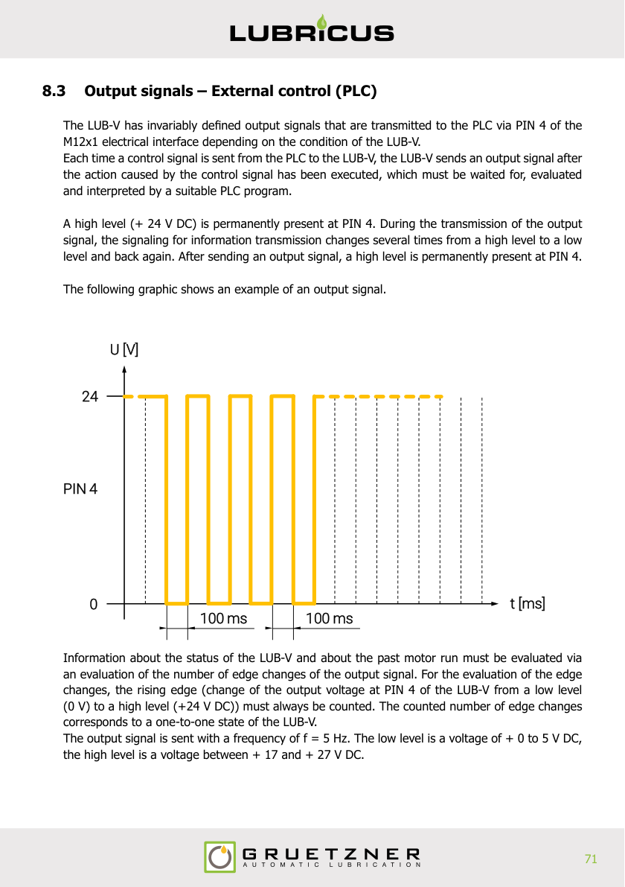

# LUB-V External Control (PLC) Protocol Documentation

## Overview

The LUB-V lubrication system can be controlled via an external PLC when switched to **pulse mode** (Settings menu, chap. 6.3.4). The system uses a 4-pin M12x1 female connector (A-coded) for communication. Control signals of defined length are sent from the PLC to the LUB-V via PIN 2; the LUB-V responds via high/low levels on PIN 4.

### ⚠️ SAFETY WARNING

> **DANGER — Machine elements that are not lubricated can cause failures resulting in serious injury or death.**
> - A PLC program corresponding to the communication protocol **must** be created.
> - After sending a control signal, the response signal **must** be waited for, evaluated and interpreted to prevent uncontrolled failure of the LUB-V.

---

## Protocol Mode Selection — Modern vs Legacy

The LUB-V supports two pulse-width protocols. **The first signal received after power-on determines which protocol the device uses for the entire session.** Sending a legacy-length pulse (e.g. 2 s) at any point after power-on will lock the device into legacy mode.

| | Modern (2022+) | Legacy (2010–2022) |
|---|---|---|
| 1 Lubrication stroke | 100 ms | 2 000 ms |
| Filling | 900 ms | 12 000 ms |
| Cancel filling | 1 000 ms | *(no legacy equivalent)* |
| Status request | 1 600 ms | *(no legacy equivalent)* |
| Acknowledge error | 1 700 ms | 14 000 ms |

**To switch between modes:** Interrupt the supply voltage for a few seconds, then reconnect. The next signal received will set the mode.

> ⚠️ Modern and legacy commands **must not** be mixed in the same power-on session. The device will reject signals that don't match the active protocol and return an "inadmissible signal" response (16 edge changes).

---

## Pin Assignment (M12x1, 4-pin, A-coded)

| PIN | Assignment | Standard M12 Colour |
|-----|-----------|---------------------|
| 1   | +24 V DC  | Brown               |
| 2   | Input signal (PLC → LUB-V) | White |
| 3   | Ground    | Blue                |
| 4   | Output signal (LUB-V → PLC) | Black |

### Important Notes
- Maximum output current at PIN 4: **I_max < 20 mA**. No inductive loads (e.g. relays) may be connected.
- The LUB-V can be completely switched off by removing supply voltage; settings are retained.
- After a long standstill, trigger "1 lubrication stroke" twice manually (100 ms each) before resuming normal operation.

---

## Input Signals — Control Signals from PLC (Chap. 8.2)

All control signals are sent as **+24 V DC high level** on PIN 2. Each duration has a tolerance of **±25 ms**. The maximum accepted pulse length is 1 700 ±25 ms (modern mode); anything outside tolerance triggers an "inadmissible signal" response.

| Signal Length | Function | Legacy Equivalent | Section |
|--------------|----------|-------------------|---------|
| 100 ms (75–125) | 1 lubrication stroke | 2 000 ms (1 975–2 025) | 8.2.1 |
| 900 ms (875–925) | Filling (40 strokes) | 12 000 ms (11 975–12 025) | 8.2.2 |
| 1 000 ms (975–1 025) | Cancel filling | — | 8.2.3 |
| 1 600 ms (1 575–1 625) | Status request | — | 8.2.4 |
| 1 700 ms (1 675–1 725) | Acknowledge error | 14 000 ms (13 975–14 025) | 8.2.5 |

---

### 8.2.1 — 1 Lubrication Stroke

#### Summary
| | Modern | Legacy |
|---|---|---|
| Pulse width | **100 ms** (75–125) | **2 000 ms** (1 975–2 025) |

- Triggers a **single** lubrication stroke delivering **0.15 ml**.
- Stroke duration: **7–17 s** (depends on back-pressure and temperature).
- Device must show ready (PIN 4 high) for **>500 ms** before command is accepted.
- Wait **>500 ms** after the response signal before sending the next command.

#### Detail

**Prerequisites:**
- LUB-V properly connected to the external controller and powered.
- Pulse mode activated.
- No errors present; LUB-V is ready for operation.
- PIN 4 sends a permanent high level indicating readiness to the PLC. This signal must be present **permanently and uninterruptedly for >500 ms** before an activation is possible.

**Sequence:**
1. The PLC sends a high-level pulse of the specified duration on PIN 2.
2. While the high level is present at PIN 2, the pulse-mode symbol flashes in the LUB-V display.
3. Immediately after the control signal drops, lubrication stroke C starts — 0.15 ml of lubricant is delivered.
4. The LUB-V monitors the stroke for its entire duration (7–17 s). During the stroke a numerical value 1–70 is shown on the display indicating approximate back-pressure in bar.
5. At the end of the stroke, the LUB-V sends an output signal on PIN 4 reporting the result (see Output Signals, chap. 8.3).
6. If the micro-electronics detects an error during or after the stroke, the corresponding error output signal is sent.

---

### 8.2.2 — Filling Function

#### Summary
| | Modern | Legacy |
|---|---|---|
| Pulse width | **900 ms** (875–925) | **12 000 ms** (11 975–12 025) |

- Triggers **40 consecutive** lubrication strokes with **2 s relaxation** between each.
- Total volume: **6.0 ml** (40 × 0.15 ml).
- During filling, the **only** accepted command is "Cancel filling" (chap. 8.2.3).
- Each stroke produces an output signal on PIN 4; monitor all 40 responses.

#### Detail

**Prerequisites:**
- LUB-V properly connected to the external controller and powered.
- Pulse mode activated.
- No errors present; LUB-V is ready for operation.
- PIN 4 high for >500 ms.

**Sequence:**
1. The PLC sends a high-level pulse of the specified duration on PIN 2.
2. While the high level is present, the pulse-mode symbol flashes in the display.
3. Immediately after the signal drops, the first lubrication stroke C₁ starts (0.15 ml).
4. The LUB-V monitors the stroke (7–17 s); display shows back-pressure 1–70 bar.
5. At the end of each stroke C, the LUB-V sends an output signal on PIN 4.
6. A total of **40 strokes** (C₁–C₄₀) and **39 relaxation phases** (tE, 2 s each) execute in succession.
7. At the earliest >500 ms after the **last** output signal, the next control signal can be sent.
8. The filling function can be stopped at any time with "Cancel filling" (chap. 8.2.3).

---

### 8.2.3 — Cancel Filling

#### Summary
| | Modern | Legacy |
|---|---|---|
| Pulse width | **1 000 ms** (975–1 025) | *No legacy equivalent* |

- Stops an active filling function.
- The **only** command the LUB-V accepts during a filling operation.
- If sent during a stroke, the current stroke completes before cancellation.
- Response: 1 edge change on PIN 4 ("filling function canceled").

#### Detail

**Prerequisites:**
- The filling function has been activated by the "Filling" control signal.
- The LUB-V is currently carrying out the filling function.

**Sequence:**
1. The PLC sends a 1 000 ms high-level pulse on PIN 2 **during the relaxation time** (tE) between two strokes.
2. At the end of the pulse, the LUB-V stops the filling function directly.
3. If the pulse is sent **during** a lubrication stroke C, the current stroke completes first, then the filling function is canceled.
4. At the earliest >500 ms after the response signal, the next control signal can be sent.

---

### 8.2.4 — Status Request (Sign of Presence)

#### Summary
| | Modern | Legacy |
|---|---|---|
| Pulse width | **1 600 ms** (1 575–1 625) | *No legacy equivalent* |

- Queries the last status / last stroke result.
- Can be used **cyclically** to verify the LUB-V is reachable (heartbeat / sign of presence).
- The LUB-V repeats the output signal of the most recent lubrication stroke.

#### Detail

**Prerequisites:**
- LUB-V properly connected to the external controller and powered.
- Pulse mode activated.
- PIN 4 high for >500 ms.

**Sequence:**
1. The PLC sends a 1 600 ms high-level pulse on PIN 2.
2. After the pulse ends, the LUB-V **repeats** the output signal of the past lubrication stroke on PIN 4.
3. At the earliest >500 ms after the response signal, the next control signal can be sent.

---

### 8.2.5 — Acknowledge Error

#### Summary
| | Modern | Legacy |
|---|---|---|
| Pulse width | **1 700 ms** (1 675–1 725) | **14 000 ms** (13 975–14 025) |

- Acknowledges **E2** (overpressure) or **E3** (over/undervoltage) errors.
- The **only** command accepted when an error output signal was returned.
- The cause of the error **must** be identified and eliminated before sending this command.

#### Detail

**Prerequisites:**
- LUB-V properly connected to the external controller and powered.
- Pulse mode activated.
- An E2 or E3 error is present on the LUB-V.
- The output signal at PIN 4 has reported an E2 or E3 error.
- The cause of the error has been identified and eliminated.

**Sequence:**
1. The PLC sends a high-level pulse of the specified duration on PIN 2.
2. After the pulse ends, the LUB-V micro-electronics performs an internal self-check:
   - ✅ **Check successful:** The error is acknowledged; LUB-V returns to ready-for-operation state.
   - ❌ **Check unsuccessful:** The LUB-V continues to send an error output signal. The error is still present. Check the lubrication point and LUB-V again, then re-send "Acknowledge error". If the second attempt also fails, return the LUB-V with cartridge to the manufacturer with a detailed fault description.
3. At the earliest >500 ms after the response signal, the next control signal can be sent.

---

## Output Signals — Response from LUB-V (Chap. 8.3)

#### Summary

- **PIN 4** is permanently HIGH (+24 V DC) when the device is ready.
- After each command, the LUB-V responds with a pulse train on PIN 4 — count the **rising edges** (low → high).
- Pulse train frequency: **5 Hz** (100 ms high, 100 ms low).
- Low level: 0–5 V DC; High level: 17–27 V DC.
- The edge count maps 1-to-1 to a device state (see table below).

#### Detail

A high level is permanently present at PIN 4. During the output signal, the level toggles between high and low to transmit information. After the output signal, PIN 4 returns to permanent high.

| Edge Changes | Information | Remedy |
|:---:|---|---|
| 1 | Filling function canceled | None necessary (informative) |
| 2 | Past lubrication stroke OK | None necessary (informative) |
| 3 | Past stroke OK, **cartridge soon empty** | Buy a new cartridge in time |
| 4 | **Overpressure (E2)** at outlet 1 | Check lubrication point, eliminate cause, acknowledge error (8.2.5) |
| 5 | **Overpressure (E2)** at outlet 2 (if present) | Check lubrication point, eliminate cause, acknowledge error (8.2.5) |
| 12 | **Cartridge empty** | Change cartridge — auto-cleared after shutdown |
| 14 | **Over-/undervoltage (E3)** | Check power supply, acknowledge error (8.2.5) |
| 15 | **Internal device error (E4)** | Return to manufacturer with description |
| 16 | **Inadmissible / undefined signal** | Check PLC program for correctness |

---

## Timing & Communication Rules

| Rule | Value |
|------|-------|
| Ready-state qualification | PIN 4 HIGH for **>500 ms** continuously |
| Minimum gap between commands | **>500 ms** after end of response signal |
| Response timeout | **30 s** — if no response, send status request |
| Recovery after timeout | Disconnect supply voltage for **≥10 s**, reconnect, send status request |
| PIN 4 stuck LOW (pulse mode, power on) | Cable fault or serious device error — return to manufacturer |

---

## Quick Reference — PLC Integration Checklist

1. **Power on** the LUB-V; wait for PIN 4 HIGH for >500 ms (device ready).
2. **Choose protocol** — the first command sent sets the mode (modern or legacy). Do not mix.
3. **Send command** — set PIN 2 HIGH for the required duration, then drop to LOW.
4. **Wait for response** — count rising edges on PIN 4 (5 Hz train); decode per output signal table.
5. **Inter-command gap** — wait >500 ms after the last rising edge before the next command.
6. **Filling loop** — after a filling command, repeat step 4 for each of the 40 strokes; only "Cancel filling" is accepted in between.
7. **Error handling** — on edge counts 4/5/14, identify and fix the cause, then send "Acknowledge error".
8. **Timeout** — no response within 30 s → send status request. Still nothing → power-cycle for ≥10 s and retry.
