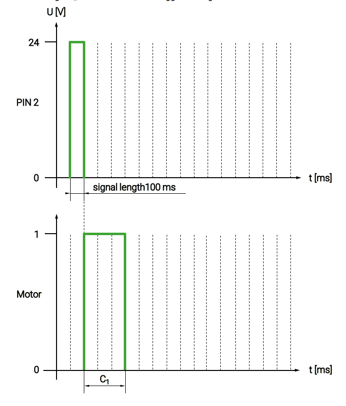
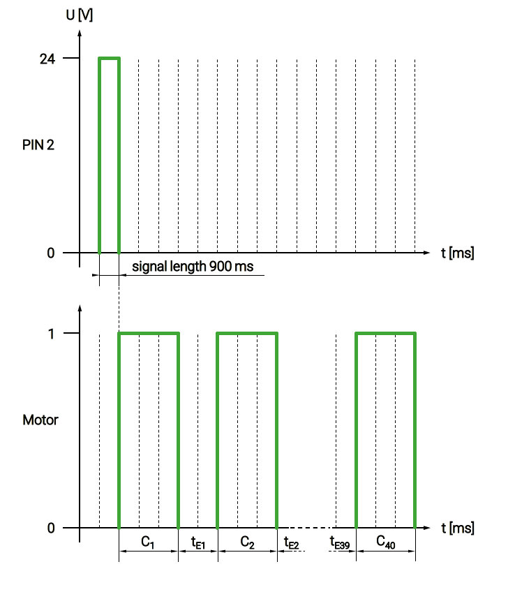
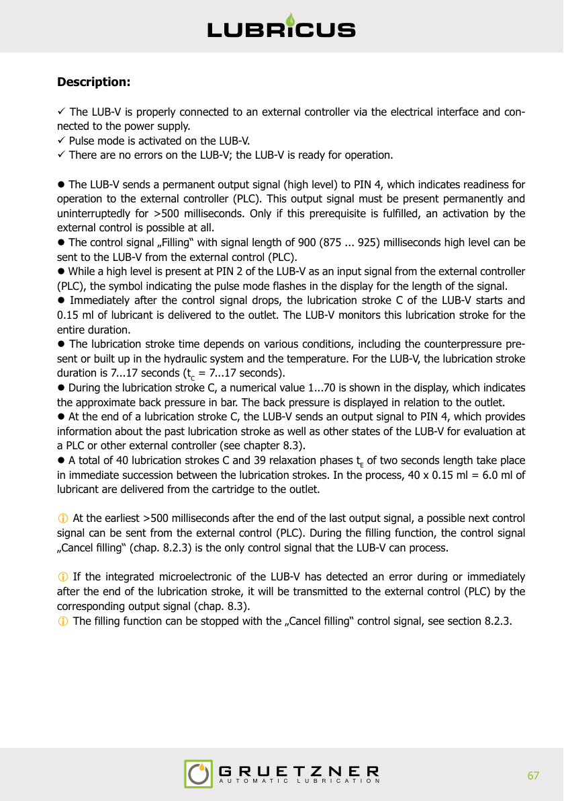
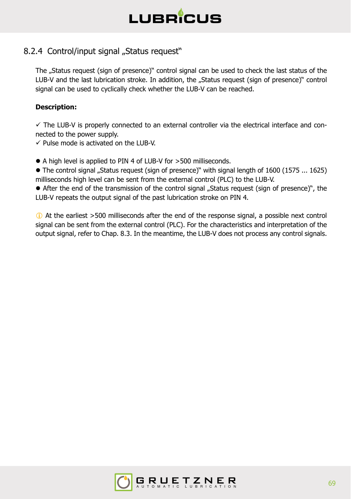
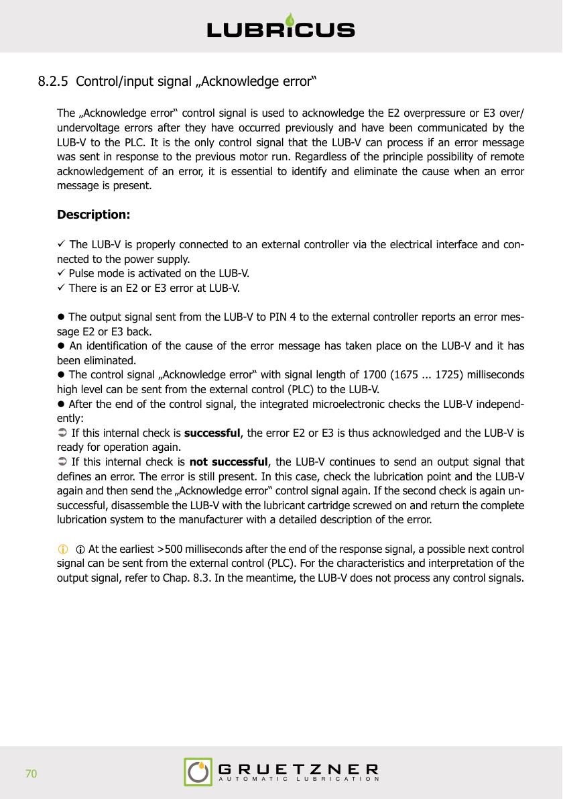

# LUB-V External Control (PLC) Protocol Documentation

## Overview

The LUB-V lubrication system can be controlled via an external PLC when switched to pulse mode. The system uses a 4-pin M12x1 female connector (A-coded) for communication.

### ⚠️ SAFETY WARNING
Machine elements that are not lubricated can cause failures resulting in serious injury or death.
- A program corresponding to the communication protocol must be created in the PLC
- After sending a control signal, the response signal must be waited for, evaluated and interpreted

## Pin Assignment

| PIN | Assignment | Standard M12 Color |
|-----|------------|--------------------|
| 1   | +24 V DC   | Brown              |
| 2   | Input signal (from PLC to LUB-V) | White |
| 3   | Ground     | Blue               |
| 4   | Output signal (from LUB-V to PLC) | Black |

### Important Notes
- Maximum output current at PIN 4: Imax < 20mA
- No inductive loads (e.g., relays) may be connected to PIN 4
- The LUB-V can be completely switched off by removing supply voltage without losing settings
- After long standstill, trigger "1 lubrication stroke" twice manually (100 ms)

---

## Input Signals (Control Signals from PLC)

All control signals are sent as high level (+24 V DC) to PIN 2 with tolerance of ±25 milliseconds.

| Signal Length (ms) | Function | Reference |
|-------------------|----------|-----------|
| 100 | 1 lubrication stroke | Chap. 8.2.1 |
| 900 | Filling | Chap. 8.2.2 |
| 1000 | Cancel filling | Chap. 8.2.3 |
| 1600 | Status request (sign of presence) | Chap. 8.2.4 |
| 1700 | Acknowledge error | Chap. 8.2.5 |

### 1. Single Lubrication Stroke (100 ms)

**Signal duration:** 75-125 ms

**Prerequisites:**
- LUB-V connected and powered
- Pulse mode activated
- No errors present
- Ready signal (high level) present at PIN 4 for >500 ms

**Operation:**
- Delivers 0.15 ml of lubricant
- Stroke duration: 7-17 seconds
- Display shows back pressure: 1-70 bar
- Wait >500 ms after response signal before sending next command

### 2. Filling Function (900 ms)

**Signal duration:** 875-925 ms

**Operation:**
- Executes 40 consecutive lubrication strokes
- 2-second relaxation phase between strokes
- Total volume: 6.0 ml (40 × 0.15 ml)
- Only "Cancel filling" command accepted during execution

### 3. Cancel Filling (1000 ms)

**Signal duration:** 975-1025 ms

**Operation:**
- Stops filling function
- Can only be sent during filling operation
- If sent during a stroke, current stroke completes before cancellation

### 4. Status Request (1600 ms)

**Signal duration:** 1575-1625 ms

**Operation:**
- Checks last status of LUB-V
- Repeats output signal of past lubrication stroke
- Can be used to cyclically verify LUB-V is reachable

### 5. Acknowledge Error (1700 ms)

**Signal duration:** 1675-1725 ms

**Operation:**
- Acknowledges E2 (overpressure) or E3 (over/undervoltage) errors
- Only command accepted when error is present
- Cause of error must be identified and eliminated before acknowledgment
- LUB-V performs internal self-check after acknowledgment

---

## Output Signals (Response from LUB-V)

Output signals are transmitted via PIN 4 as edge changes from low level (0-5 V DC) to high level (+17 to +27 V DC).

**Frequency:** 5 Hz  
**Evaluation method:** Count rising edges (low to high transitions)

### Output Signal Codes

| Edge Changes | Information | Remedy |
|--------------|-------------|--------|
| 1 | Filling function canceled | None necessary (informative) |
| 2 | Past lubrication stroke OK | None necessary (informative) |
| 3 | Past lubrication stroke OK, cartridge soon empty | Buy new cartridge in time |
| 4 | Overpressure (E2) at outlet 1 | Check lubrication point, eliminate cause, acknowledge error |
| 5 | Overpressure (E2) at outlet 2 (if present) | Check lubrication point, eliminate cause, acknowledge error |
| 12 | Cartridge empty | Change cartridge (automatically cleared after shutdown) |
| 14 | Over-/undervoltage (E3) | Check power supply, acknowledge error |
| 15 | Internal device error (E4) | Return to manufacturer with description |
| 16 | Inadmissible/undefined control signal received | Check PLC program for correctness |

### Timing Requirements
- Wait >500 ms after output signal before sending next control signal
- LUB-V sends response within 30 seconds of control signal
- If no response after 30 seconds, send status request
- If still no response, disconnect power for 10 seconds and retry

---

## Communication Protocol Notes

1. **Ready State:** High level permanently present at PIN 4 indicates readiness
2. **Processing Time:** No control signals processed during operation (wait for response)
3. **Timeout Handling:** If no response after 30 sec, check with status request
4. **Error Recovery:** Disconnect power for 10 sec if communication fails completely
5. **Low Level at PIN 4:** Indicates cable problem or serious device error
